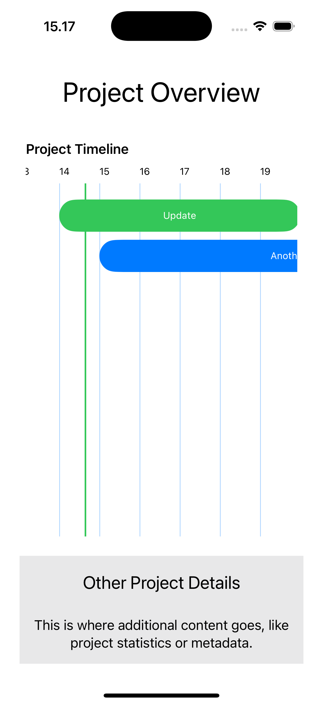

# ``TimelineSDK``

TimelineSDK is a Swift framework for creating customizable project timelines in iOS apps.

## Preview

Here’s what you can achieve with TimelineSDK:



## Overview

This SDK provides a simple way to create a project timeline with customizable styles and components. It’s perfect for developers who need an intuitive, ready-to-use timeline component that’s lightweight and flexible.

## Requirements
- Swift Version: Swift 5.5 or later
- iOS Version: iOS 15 or later
- Xcode Version: Xcode 13 or later
 
## Topics

### Main Component

- TimelineView<br>
The primary and ready-to-use component for displaying a project timeline.
TimelineView handles task arrangement, date alignment, and customizable appearance, such as grid lines, date labels, and a date indicator.

### Supporting Components (Optional Use)

- TaskBarsView<br>
Displays the task bars in the timeline.
While already integrated into TimelineView, this component can be used standalone for custom setups.

- HorizontalDateLabelsView<br>
Displays dates horizontally across the timeline.
Allows customization of the text color and formatting.

- HorizontalGridLinesView<br>
Renders vertical grid lines for better alignment of tasks and dates.
Grid line colors and opacity can be customized.

- DateIndicatorView<br>
Displays a vertical indicator line for the current or selected date.

## Integration

### Installation

Add TimelineSDK to your project using Swift Package Manager:
1. In Xcode, go to `File` > `Add Packages`
2. Enter the repository URL: `https://github.com/inezamanda/TimelineSDK`

### Usage

The primary integration revolves around TimelineView. Here’s how to use it:

**Step 1: Create a Model conforming to TimelineTask**

To use TimelineView, your task data model needs to conform to the TimelineTask protocol. Here’s an example of a model:
```
import TimelineSDK
import SwiftUI

struct MyTask: TimelineTask {
    let id: UUID = UUID()
    let name: String
    let startDate: Date
    let endDate: Date
    let color: Color
}
```
Your custom task model must include the following properties:
- id: A unique identifier (UUID)
- name: The task name (e.g., “Design Phase”)
- startDate: The task’s start date
- endDate: The task’s end date
- color: The color used for displaying the task in the timeline

Once your model conforms to `TimelineTask`, you can pass an array of tasks into the `TimelineView`.

**Step 2: Prepate the tasks**

Create an array of tasks using your custom `MyTask` model:
```
let tasks: [MyTask] = [
    MyTask(
        name: "Design Phase",
        startDate: Calendar.current.date(from: DateComponents(year: 2024, month: 11, day: 1))!,
        endDate: Calendar.current.date(from: DateComponents(year: 2024, month: 11, day: 5))!,
        color: .blue
    ),
    MyTask(
        name: "Development Phase",
        startDate: Calendar.current.date(from: DateComponents(year: 2024, month: 11, day: 6))!,
        endDate: Calendar.current.date(from: DateComponents(year: 2024, month: 11, day: 20))!,
        color: .green
    ),
    MyTask(
        name: "Testing Phase",
        startDate: Calendar.current.date(from: DateComponents(year: 2024, month: 11, day: 21))!,
        endDate: Calendar.current.date(from: DateComponents(year: 2024, month: 11, day: 30))!,
        color: .red
    )
]
```

**Step 3: Use TimelineView**
```
let startDate = Calendar.current.date(from: DateComponents(year: 2024, month: 11, day: 1))!
let endDate = Calendar.current.date(from: DateComponents(year: 2024, month: 11, day: 30))!
let focusDate = Calendar.current.date(from: DateComponents(year: 2024, month: 11, day: 15))!

var body: some View {
    TimelineView(
        tasks: tasks,
        startDate: startDate,
        endDate: endDate,
        focusDate: focusDate
    )
    .setTitle("Project Timeline")
    .horizontalGridLine(gridLineColor: Color.blue.opacity(0.3))
    .horizontalDateLabels(textColor: Color.black)
    .dateIndicatorLine(indicatorColor: Color.green)
}
```

### Customization Options

**TimelineView** modifiers
- `setTitle(_:)`<br>
Customizes the title text.
- `horizontalGridLine(gridLineColor:)`<br>
Customizes the color of the vertical grid lines.
- `horizontalDateLabels(textColor:)`<br>
Customizes the color of the date labels.
- `dateIndicatorLine(indicatorColor:)`<br>
Customizes the color of the vertical date indicator line.